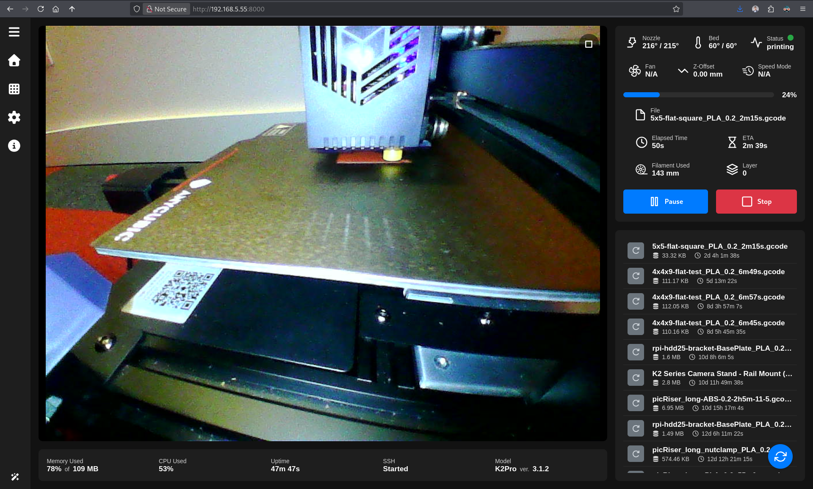
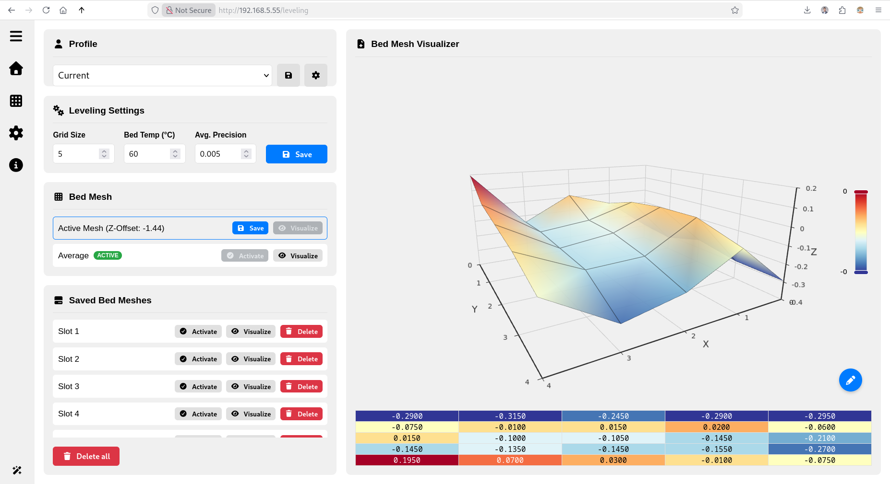
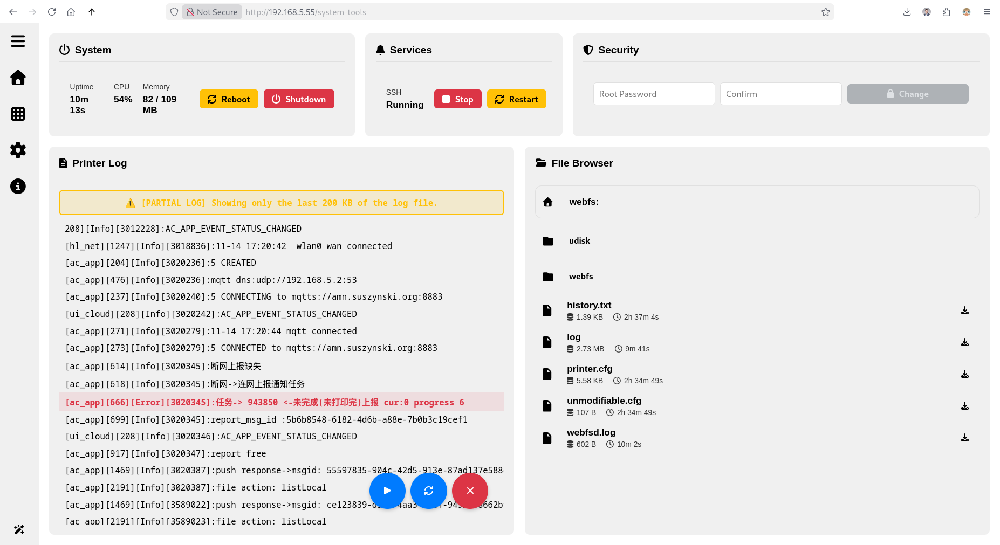
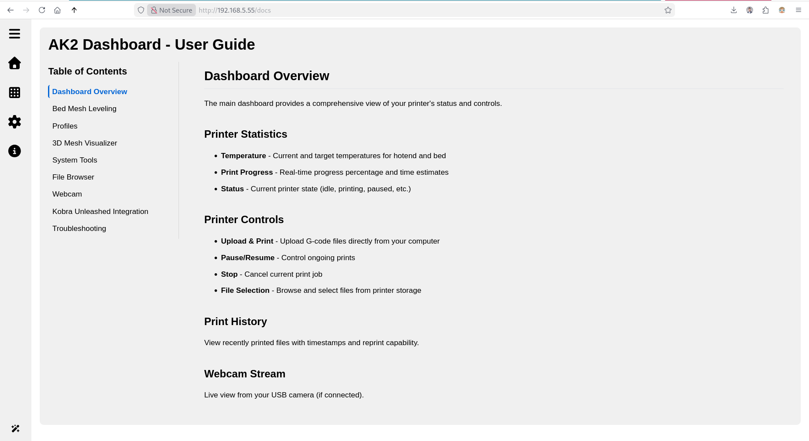

# AK2 Dashboard

**Modern web interface for Anycubic Kobra 2 Series 3D printers**

A community-maintained fork bringing a complete UI overhaul, advanced bed leveling, and full printer control to your browser.



## About This Project

This is an actively maintained fork of [AGG2017's ACK2-Webserver](https://github.com/AGG2017/ACK2-Webserver), featuring a complete transformation from static HTML to a modern Svelte application. Born from the Kobra 2 hacking community's efforts to overcome Anycubic's closed-source limitations, this project is part of a larger ecosystem of tools that enable full control over your printer.

**Why this exists:** Anycubic released the Kobra 2 series with locked-down, closed-source firmware. The community reverse-engineered access, and this dashboard is one of the results - now maintained and actively developed after the original projects were abandoned.

## ✨ Key Features

- 🎯 **Comprehensive Dashboard** - Real-time stats, webcam stream, and full printer control
- 🔧 **Advanced Bed Mesh Leveling** - Intelligent averaging algorithm for consistent first layers
- 📊 **3D Mesh Visualization** - See your bed topology in stunning detail
- 🛠️ **System Tools** - Monitor resources, manage services, view logs in real-time
- 📁 **Smart File Browser** - Syntax highlighting, hex dump for binaries, easy navigation
- 🎨 **Modern Design** - Light/dark themes, responsive layout, intuitive interface
- ⚡ **Resource Efficient** - <1% memory usage, minimal CPU impact

## 📚 Documentation

- **[Installation Guide](INSTALL.md)** - Complete installation instructions
- **[User Guide](DOCS.md)** - Feature usage and troubleshooting
- **[About](ABOUT.md)** - Project history, credits, and community
- **[Frontend Development](frontend/README.md)** - Svelte development guide
- **[Backend Development](src/README.md)** - C backend and API documentation

## 🚀 Quick Start

### For Users

**⚠️ Requires a jailbroken Kobra 2 Series printer**

**Already Jailbroken?** Deploy directly via SSH:

```bash
git clone https://github.com/cardil/ak2-dashboard
cd ak2-dashboard
make deploy PRINTER_IP=192.168.1.100
```

**New User?** See **[INSTALL.md](INSTALL.md)** for complete jailbreak and installation instructions.

**Access Dashboard:** `http://YOUR_PRINTER_IP:8000`

### For Developers

**Build the entire package:**
```bash
make
```

**Development mode (frontend only):**
```bash
cd frontend
npm install
npm run dev
```

See [frontend/README.md](frontend/README.md) and [src/README.md](src/README.md) for details.

## 📁 Project Structure

```
├── src/                   # C backend (WEBFS + custom API)
├── frontend/              # Svelte frontend application
├── webserver/             # Packaged web resources
├── INSTALL.md             # Installation guide
├── DOCS.md                # Feature usage guide
├── ABOUT.md               # Project history and credits
└── Makefile               # Build and deployment automation
```

## 🛠️ Technology Stack

**Backend:**
- [WEBFS](https://linux.bytesex.org/misc/webfs.html) - Lightweight static web server
- [glibc](https://www.gnu.org/software/libc/) - GNU C Library for ARM cross-compilation
- Custom C API for printer integration

**Frontend:**
- [SvelteKit](https://kit.svelte.dev/) - Modern web application framework
- [Apache ECharts](https://echarts.apache.org/) - 3D mesh visualization
- [Prism.js](https://prismjs.com/) - Syntax highlighting

## 🌟 Highlights

### Unified Printer Control
No more juggling multiple interfaces! Integrated printer controls (upload, print, pause/resume, stop) directly in the dashboard via Kobra Unleashed API integration. One interface for everything - bed leveling, system tools, and printer control.

### Advanced Bed Leveling
The stock firmware's inconsistent probing is solved with an intelligent averaging algorithm. Run leveling multiple times, save each result, and the system computes a statistically superior mesh for perfect first layers.

### Real-Time System Monitoring
View CPU usage, memory, temperatures, and service status. Access printer logs with error highlighting, deduplication, and follow mode.

### File Management
Browse the printer filesystem with syntax-highlighted previews for code and configs, plus hex dump view for binary files.

## 🤝 Community & Credits

### Join the Discussion
- 💬 [Telegram Group](https://t.me/kobra2modding) - Active community for questions, bugs, and development
- 📖 [Klipper Discourse Thread](https://klipper.discourse.group/t/printer-cfg-for-anycubic-kobra-2-plus-pro-max/11658) - Original reverse engineering discussions (archived)
- 📚 [Kobra 2 Pro Insights](https://1coderookie.github.io/Kobra2ProInsights) - Comprehensive printer documentation by 1coderookie

### The Kobra 2 Hacking Ecosystem

This project is part of a suite of community tools for Kobra 2 printers:

**Maintained Forks (by cardil):**
- 🔧 [kobra2-fw-tools](https://github.com/cardil/kobra2-fw-tools) - Jailbreak tools and custom firmware builder (fork of deleted ultimateshadsform/Anycubic-Kobra-2-Series-Tools)
- 🌐 [AK2 Dashboard](https://github.com/cardil/ak2-dashboard) - This project (fork of AGG2017/ACK2-Webserver)
- 🚀 [Kobra Unleashed](https://github.com/cardil/kobra-unleashed) - MQTT server for cloud printing (fork of anjomro/kobra-unleashed)

**Original Projects:**
- [AGG2017/ACK2-Webserver](https://github.com/AGG2017/ACK2-Webserver) - Original webserver (unmaintained)
- [anjomro/kobra-unleashed](https://github.com/anjomro/kobra-unleashed) - Original MQTT server (unmaintained)
- ultimateshadsform/Anycubic-Kobra-2-Series-Tools - Original firmware tools (deleted)

**Alternative Solutions:**
- [Rinkhals](https://jbatonnet.github.io/Rinkhals) - Modern alternative for Kobra 3 and some K2 Pro units with newer boards

### Credits & Thanks

**Original Authors:**
- **[@AGG2017](https://github.com/AGG2017)** - Original ACK2-Webserver author
- **[@anjomro](https://github.com/anjomro)** - Original Kobra Unleashed author
- **ultimateshadsform** - Original firmware tools author (repository deleted)
- **[@1coderookie](https://github.com/1coderookie)** - Comprehensive Kobra 2 Pro documentation
- **[@jbatonnet](https://github.com/jbatonnet)** - Rinkhals project

**Community Contributors:**
- **[Kuroi](https://klipper.discourse.group/u/kuroi)** - Initial printer.cfg dumps and reverse engineering
- **[Boris](https://klipper.discourse.group/u/boris)** - UART and boot process documentation
- The entire [Klipper Discourse community](https://klipper.discourse.group/t/printer-cfg-for-anycubic-kobra-2-plus-pro-max/11658) who reverse-engineered these printers
- Everyone in the [Telegram group](https://t.me/kobra2modding) contributing bug reports, testing, and feedback

**Built On:**
- [WEBFS](https://linux.bytesex.org/misc/webfs.html) by Gerd Hoffmann
- [glibc](https://www.gnu.org/software/libc/) - GNU C Library

## 🤲 Contributing

Contributions are welcome! Whether you're:
- 🐛 Reporting bugs
- ✨ Suggesting features
- 📝 Improving documentation
- 💻 Submitting code
- 🧪 Testing on your printer

See the development guides in [frontend/README.md](frontend/README.md) and [src/README.md](src/README.md).

**Development History:**
- Evolved from AGG2017's static HTML webserver
- Webcam improvement: 0.5 fps → 8 fps
- Complete UI overhaul: Static HTML → Modern Svelte SPA
- Goal: Revive interest in Kobra 2 hacking and provide a solid foundation for future development

## 📜 License

Open source project. Check individual files for specific licenses. Built on WEBFS (public domain) and incorporates various open-source libraries.

## ⚠️ Important Disclaimers

**Jailbreak Required:** This dashboard requires a jailbroken Kobra 2 printer with root access via UART. See [INSTALL.md](INSTALL.md) for complete instructions.

**No Firmware Distributed:** This project does NOT host or distribute Anycubic firmware files. The [kobra2-fw-tools](https://github.com/cardil/kobra2-fw-tools) downloads official firmware from Anycubic's public servers and provides tools to modify it.

**Community Project:** Not affiliated with or endorsed by Anycubic. Installing custom firmware may void your warranty. The original firmware contains parts of Klipper (evidenced by printer.cfg format), which raises questions about GPL compliance.

**Use at Your Own Risk:** Always backup important files (`/user` directory) before modifications. Keep working firmware files accessible. This is experimental software developed by the community.

**Maintained Fork:** The original projects (ACK2-Webserver, Kobra Unleashed, firmware tools) were abandoned. These forks are actively maintained to keep the Kobra 2 hacking community alive.

## 📸 Screenshots

<details>
<summary>Click to view more screenshots</summary>






</details>

---

**Built with ❤️ by the Kobra 2 modding community**
